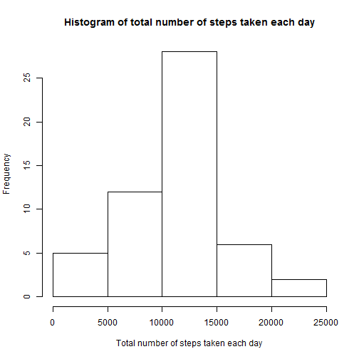
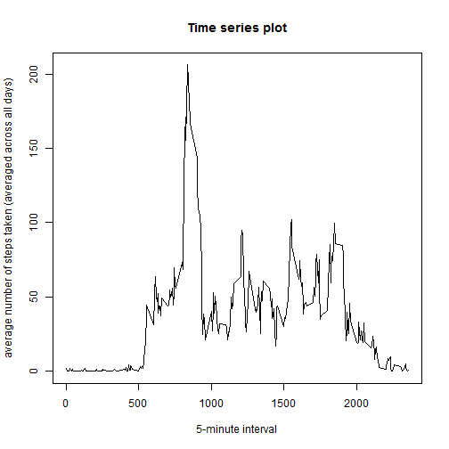
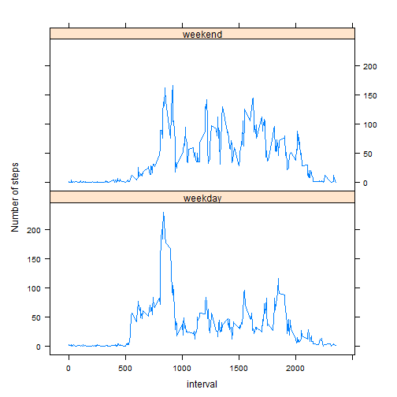

RepData peer Assesssment 1
========================================================

Loading and preprocessing the data
========================================================

* Load the data

```r
file <- read.csv("activity.csv", stringsAsFactors=FALSE)
```

* Process/transform the data (if necessary) into a format suitable for your analysis

```r
totalStepsByDate <- aggregate(steps ~ date, 
                              data=file, 
                              FUN = sum, 
                              na.rm=TRUE)
```

What is mean total number of steps taken per day?
========================================================

For this part of the assignment, the missing values in the dataset are ignored.

* Make a histogram of the total number of steps taken each day


```r
hist(totalStepsByDate$steps, 
     main="Histogram of total number of steps taken each day", 
     xlab="Total number of steps taken each day", 
     ylab="Frequency")
```

 

* Calculate and report the mean and median total number of steps taken per day

```r
mean(totalStepsByDate$steps)
```

```
## [1] 10766
```

```r
median(totalStepsByDate$steps)
```

```
## [1] 10765
```

* The **mean** total number of steps taken per day is 
    1.0766 &times; 10<sup>4</sup> steps.
* The **median** total number of steps taken per day is 
    10765 steps.

What is the average daily activity pattern?
========================================================

* Make a time series plot (i.e. type = "l") of the 5-minute interval (x-axis) and the average number of steps taken, averaged across all days (y-axis)


```r
averageStepsByInterval <- aggregate(steps ~ interval, 
                                    data = file, 
                                    FUN = mean, 
                                    na.rm=TRUE)
plot(averageStepsByInterval, 
     type="l", 
     main="Time series plot", 
     xlab = "5-minute interval", 
     ylab="average number of steps taken (averaged across all days)")
```

 

* Which 5-minute interval, on average across all the days in the dataset, contains the maximum number of steps?


```r
averageStepsByInterval[averageStepsByInterval$steps == max(averageStepsByInterval$steps),][["interval"]]
```

```
## [1] 835
```

* It is the **835th** interval

Imputing missing values
========================================================

* Calculate and report the total number of missing values in the dataset (i.e. the total number of rows with NAs)


```r
length(file$steps[is.na(file$steps)])
```

```
## [1] 2304
```

* Devise a strategy for filling in all of the missing values in the dataset. The strategy does not need to be sophisticated. For example, you could use the mean/median for that day, or the mean for that 5-minute interval, etc.

  * The strategy that I'll be using to fill in the missing values in the dataset is by replacing the missing values with the mean for that 5-minute interval.
  
* Create a new dataset that is equal to the original dataset but with the missing data filled in


```r
file2 <- file
for (i in 1:nrow(file2)) {
  if(is.na(file2$steps[i])) {
    curInterval = file2$interval[i]
    file2$steps[i] = averageStepsByInterval[averageStepsByInterval$interval == curInterval,][["steps"]]
  }
}
```

* Make a histogram of the total number of steps taken each day and Calculate and report the mean and median total number of steps taken per day. Do these values differ from the estimates from the first part of the assignment? What is the impact of imputing missing data on the estimates of the total daily number of steps?


```r
totalStepsByDate2 <- aggregate(steps ~ date, data=file2, FUN = sum)
hist(totalStepsByDate2$steps,
     main="Histogram of total number of steps taken each day",
     xlab="Total number of steps taken each day",
     ylab="Frequency")
```

 

```r
mean(totalStepsByDate2$steps)
```

```
## [1] 10766
```

```r
median(totalStepsByDate2$steps)
```

```
## [1] 10766
```
* The **mean** total number of steps taken per day is 
1.0766 &times; 10<sup>4</sup> steps.
* The **median** total number of steps taken per day is 
1.0766 &times; 10<sup>4</sup> steps.

* As we can see, the **mean** value is the **same** as the value before imputing missing data because we replaced the missing values with the mean value for that particular 5-min interval. The median value shows a minute difference.

Are there differences in activity patterns between weekdays and weekends?
========================================================
* Create a new factor variable in the dataset with two levels -- "weekday" and "weekend" indicating whether a given date is a weekday or weekend day.


```r
Weekdays = c("Mon", "Tue", "Wed", "Thu", "Fri")
Weekend = c("Sat", "Sun")
days = NULL

for (i in 1:nrow(file2)) {
  curDate = file$date[i]
  day = weekdays(as.Date(file2$date[i]), abbreviate=TRUE)
  if(day %in% Weekdays) {
    days <- c(days, "weekday")
  }
  else if(day %in% Weekend) {
    days <- c(days, "weekend")
  }
}
days <- factor(days, levels=c("weekday", "weekend"))
file2$day <- days
```

* Make a panel plot containing a time series plot (i.e. type = "l") of the 5-minute interval (x-axis) and the average number of steps taken, averaged across all weekday days or weekend days (y-axis).


```r
averageStepsByIntervalAndDay <- aggregate(steps ~ interval + day, 
                                          data = file2, 
                                          FUN = mean)
library(lattice)
xyplot(steps ~ interval | day, 
       data=averageStepsByIntervalAndDay,
       ylab="Number of steps",
       aspect=1/2, 
       type="l")
```

 
